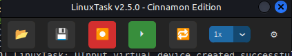
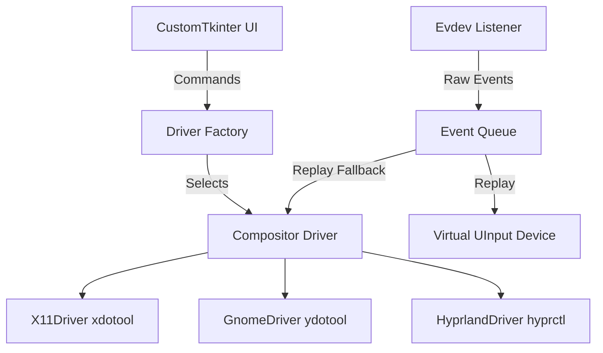

# 🚀 LinuxTask
### *Ultra-Minimalist Macro Automation with Hardware-Level Precision*

[](https://github.com/JADRT22/LinuxTask/releases)
[](LICENSE)
[](https://github.com/JADRT22/LinuxTask/stargazers)

**LinuxTask** is a professional-grade, minimalist macro recorder for Linux systems (X11 & Wayland). By interacting directly with the kernel via `evdev`, it achieves zero-loss event capture and hardware-level replay, bypassing modern compositor security restrictions with ease.

---

## 📸 Demo


---

## ✨ Key Features

- **🖥️ Desktop Agnostic**: Native drivers for **Cinnamon (X11)**, **GNOME (Wayland)**, and **Hyprland**.
- **⚡ Hardware Precision**: Direct `evdev` integration for near-zero latency recording.
- **🖱️ Full Mouse Support**: Including absolute/relative movement and scroll wheel capture.
- **🤖 Humanize Mode**: Optional randomized jitter (±2px) and time-variance (0-3%) to mimic human behavior.
- **📟 Compact UI**: Modern, distraction-free toolbar built with `customtkinter`.
- **󱄄 Global Hotkeys**: Configurable F8 (Record) and F9 (Play) triggers with `Esc` to cancel mapping.

---

## 📊 Support Matrix

| Feature | 🍃 Cinnamon (X11) | 🎨 GNOME (Wayland) | ❄️ Hyprland |
| :--- | :---: | :---: | :---: |
| **Mouse Click** | ✅ | ✅ (ydotool) | ✅ (uinput) |
| **Absolute Move** | ✅ (xdotool) | ❌ | ✅ (hyprctl) |
| **Relative Move** | ✅ (uinput) | ✅ (ydotool) | ✅ (hyprctl) |
| **Scroll Wheel** | ✅ (xdotool) | ✅ (ydotool) | ✅ (uinput) |
| **Keyboard** | ✅ | ✅ | ✅ |

---

## 🏗️ Architecture



---

## 🚀 Getting Started

### 1. Installation
Clone the repository and run the automated installer:
```bash
git clone https://github.com/JADRT22/LinuxTask.git
cd LinuxTask
./tools/install.sh
```

### 2. Configuration
Run the application and open the settings menu (⚙️) to configure global hotkeys:
```bash
./tools/run.sh
```

---

## 🔍 Troubleshooting

| Issue | Solution |
| :--- | :--- |
| **Permission Denied** | Run `./tools/install.sh` again to refresh `udev` rules and group permissions. |
| **Mouse doesn't move** | Ensure `xdotool` (X11) or `ydotool` (GNOME) is installed and the daemon is running. |
| **Hotkeys don't fire** | Check if your user is in the `input` group: `groups $USER`. |

---

## 📂 Project Organization
- `src/`: Core logic and cross-compositor drivers.
- `tests/`: Unit and automated integration tests.
- `tools/`: Installation and permission management scripts.
- `assets/`: UI resources and icons.

---
*Developed by [JADRT22](https://github.com/JADRT22). Released under the MIT License.*
