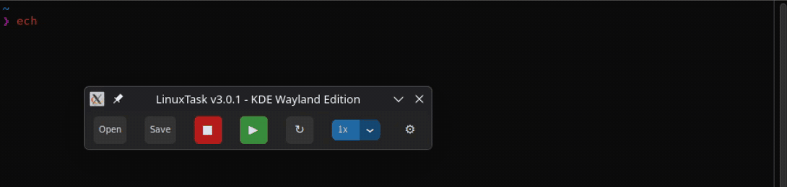
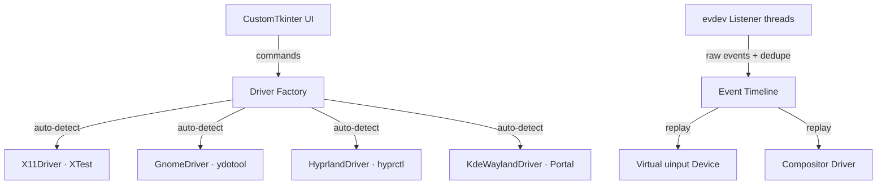

# LinuxTask — Macro Recorder for Linux

> 👤 More projects: [@JADRT22](https://github.com/JADRT22) — Hyprland automation • Roblox on Linux • MCP/agents

**A minimalist macro recorder for Linux — record and replay keyboard + mouse macros. Drivers exist for KDE Plasma Wayland, Hyprland, GNOME Wayland and X11 (see Status below).**

[](https://github.com/JADRT22/LinuxTask/releases)
[](https://github.com/JADRT22/LinuxTask/actions/workflows/python-app.yml)
[](LICENSE)
[](https://github.com/JADRT22/LinuxTask/stargazers)

LinuxTask records and replays keyboard and mouse actions on X11 and Wayland.
Recording reads events directly from the kernel via `evdev`, so nothing is
lost even when the desktop is under load. Replay uses a virtual `uinput`
device or the native APIs of your compositor, which sidesteps the input
injection restrictions that Wayland compositors impose on traditional X11
automation tools.



## Features

- **Cross-desktop drivers** — native backends for X11 (Cinnamon, MATE, XFCE…),
  GNOME Wayland, Hyprland and KDE Wayland, auto-detected at startup.
- **Hardware-precision capture** — raw `evdev` event reading with
  deduplication across multiple input devices and `time.monotonic()`-based
  scheduling, immune to NTP and DST clock jumps.
- **Full mouse support** — absolute and relative movement, button clicks and
  scroll wheel, with automatic fallback to the virtual `uinput` device when a
  compositor cannot handle an action.
- **Humanize mode** — optional ±2 px positional jitter and 0–3 % timing
  variance so replays do not look machine-perfect.
- **Playback control** — 0.5×–10× speed, loop mode, stop-at-any-time.
- **Portable macros** — a single JSON file holding the event timeline and the
  starting cursor position.
- **Global hotkeys** — record and play from any window (F8/F9 by default,
  fully remappable).
- **Compact UI** — a 400×44 px toolbar built with CustomTkinter that stays out
  of the way.

## Status

This README describes v3.1.1 (`APP_VERSION` in `src/main.py`).

| Driver | Support level |
|---|---|
| KDE Plasma Wayland | Tested by the author (CachyOS) |
| Hyprland | Implemented, not tested by the author |
| GNOME Wayland | Implemented, not tested by the author |
| X11 desktops (Cinnamon, MATE, XFCE…) | Tested by the author (KDE Plasma, X11 session) |

Implemented capability matrix (the KDE Plasma Wayland and X11 columns are verified by the author):

| | X11 desktops | GNOME Wayland | Hyprland | KDE Wayland |
|---|---|---|---|---|
| **Driver** | `python-xlib` (XTest) | `ydotool` | `hyprctl` | XDG Portal (RemoteDesktop) |
| Mouse click | ✅ | ✅ | ✅ (uinput) | ✅ |
| Absolute move | ✅ | ❌ (emulated by deltas) | ✅ | ✅ (dead-reckoned, re-synced per playback) |
| Relative move | ✅ | ✅ | ✅ | ✅ |
| Scroll | ✅ | ✅ | ✅ (uinput) | ✅ |
| Keyboard | ✅ (uinput) | ✅ (uinput) | ✅ (uinput) | ✅ |

The driver is selected automatically from `XDG_CURRENT_DESKTOP`,
`XDG_SESSION_TYPE` and `HYPRLAND_INSTANCE_SIGNATURE`; unsupported desktops
with a running X server fall back to the X11 driver.

> **Note:** every cell marked `(uinput)` above needs a working `/dev/uinput`
> device. When it is missing, the app logs a warning (`"... dropped ...
> UInput unavailable"`) and that input is skipped during replay — keyboard
> and scroll do not silently fall back to anything else. The installer
> configures `/dev/uinput` access (see Requirements).

### Known limitations

- **KDE Plasma Wayland** needs `python3-dbus` and `python3-gi` from your
  distro repositories (they cannot be installed from PyPI).
- On first run the XDG Portal shows an authorization dialog; the driver
  waits up to 120 s for approval. If approval is denied or times out,
  cursor control stays disabled for that session.
- Screen resolution is read from `kscreen-doctor`, with `xrandr` as
  fallback and 1920×1080 as a last resort.
- Cursor position is read with `xdotool getmouselocation`, which needs
  XWayland; without it the driver tracks its last known position.
- When the portal session is not ready or a portal mouse call fails, the
  driver logs a WARNING (once per reason) and the app shows a one-time
  dialog; the event falls back to `uinput` when available, otherwise it is
  skipped.

## Copy-paste in 30s

```bash
git clone https://github.com/JADRT22/LinuxTask.git && cd LinuxTask && ./tools/install.sh && ./tools/run.sh
```

Record with **F8**, replay with **F9** — global hotkeys work in any window.

> 🇧🇷 **Em Português:** LinuxTask é um gravador de macros para Linux — grava e reproduz teclado e mouse no Hyprland, GNOME Wayland, KDE Wayland e X11, com captura via `evdev` e reprodução por `uinput`/APIs do compositor. Instalação: `./tools/install.sh`, uso: `./tools/run.sh` (atalhos globais F8/F9).

## How it works


```mermaid
graph TD
    UI[CustomTkinter UI] -->|commands| Factory[Driver Factory]
    Factory -->|auto-detect| X11[X11Driver · XTest]
    Factory -->|auto-detect| Gnome[GnomeDriver · ydotool]
    Factory -->|auto-detect| Hypr[HyprlandDriver · hyprctl]
    Factory -->|auto-detect| Kde[KdeWaylandDriver · Portal]

    Listener[evdev Listener threads] -->|raw events + dedupe| Queue[Event Timeline]
    Queue -->|replay| UInput[Virtual uinput Device]
    Queue -->|replay| Driver[Compositor Driver]
```

- **Recording**: one listener thread per input device pushes keyboard, mouse
  and scroll events into a timeline. Motion is flushed on `EV_SYN` report
  boundaries — absolute coordinates when the driver supports them, relative
  deltas otherwise.
- **Playback**: the timeline is replayed at the chosen speed through the
  compositor driver first and the virtual `uinput` device as fallback, with
  optional humanize jitter applied per movement.
- **Hotkeys**: global F8/F9 presses are detected by the same evdev listeners
  and dispatched to the UI thread through a queue, keeping tkinter calls on
  the main thread.

## Getting started

### Requirements

- Python ≥ 3.10 with Tk
- `evdev`, `customtkinter`, `python-xlib` (installed by the setup script into
  the project venv at the pinned versions; the distro `python3-evdev` is only
  a fallback for the system Python)
- **GNOME Wayland only**: a running `ydotoold` daemon
- **KDE Wayland only**: `python3-dbus` and `python3-gi` from your distro
  repositories (they cannot be built from PyPI without C headers)
- Membership in the `input` group and access to `/dev/uinput`
  (the installer configures both)

### Install

```bash
git clone https://github.com/JADRT22/LinuxTask.git
cd LinuxTask
./tools/install.sh
```

The canonical scripts live in `tools/` (`tools/install.sh`,
`tools/run.sh`); the root `install.sh`/`run.sh` are thin wrappers
that forward to them.

The installer works with `apt`, `pacman` and `dnf`, installs the Python
dependencies, writes the `udev` rules, grants immediate ACL access (no
logout needed in most cases) and creates a desktop entry.

### Run

```bash
./tools/run.sh
```

Or look for **LinuxTask** in your application menu.

## Usage

| Control | Action |
|---|---|
| `●` / `■` | Start / stop recording (default hotkey **F8**) |
| `▶` / `■` | Play / stop playback (default hotkey **F9**) |
| `↻` | Toggle loop playback |
| Speed menu | Playback speed from 0.5× to 10× |
| `⚙` | Settings: remap hotkeys (press `Esc` to cancel), enable Humanize |
| Open / Save | Load / store macros as JSON files |

Hotkeys work globally: press F8 or F9 in any application. Recorded macros
store the event timeline plus the starting cursor position, and playback
returns the cursor there first so repeats are deterministic.

## Security model

Input capture only needs to *read* devices; it never writes to them. The
bundled `udev` rules therefore grant:

- `/dev/input/event*` — **read-only** (`0440` + matching read-only ACL):
  enough for recording, while withholding the full injection primitive that
  write access on real keyboards would give any process in the `input` group.
- `/dev/uinput` — read/write (`0660`): replay creates a *virtual* device, so
  injected events go through the kernel's sanctioned input path or through
  compositor APIs, never into your physical devices.

Before the first recording ever starts, the app warns that recording
captures *every* key pressed while it is on (including passwords typed
in other windows) and offers "Don't show again".

## Development

### Tests

```bash
# Hardware- and display-independent suites (the ones CI runs):
python -m unittest tests.test_main_flow tests.test_jitter tests.test_coordinate_precision
```

The command works from the repo root with no extra setup: each suite
prepends `src/` to `sys.path` internally (alternatively, run with
`PYTHONPATH=src`). The core flow suite exercises recording, playback
dispatch, macro validation and persistence headlessly by instantiating
the app without a display. `tests/test_x11_driver.py` and
`tests/test_hyprland_driver.py` additionally mock or exercise drivers
individually (run manually); `.quarantine/tests/test_evdev_access.py` needs real
hardware and `tests/test_experimental_addons.py` needs numpy/Pillow plus
a session, so neither runs in CI (see `.github/workflows/python-app.yml`
for the exact CI list).

### Release process

```bash
python3 tools/release.py --bump minor [--dry-run]
git push origin main --tags
```

The script bumps `APP_VERSION` (mirrored to the AppImage project), moves the
hand-written `[Unreleased]` notes under the new version heading (or uses a
generated draft from the commit list when `[Unreleased]` is empty), resets
`[Unreleased]` to empty, and maintains the footer link refs (`[Unreleased]`
retargeted to the new version, new `[vX]` ref inserted), commits and tags. Pushing a `v*` tag triggers the
GitHub Actions workflow that publishes the release with the changelog entry
as notes. `--dry-run` prints the exact `[vX.Y.Z]` section and footer link
refs that would be written (including the drained `[Unreleased]` body)
without touching any files.

### AppImage

```bash
tools/appimage/build.sh
```

Builds a reproducible AppImage on top of python-build-standalone.

## Troubleshooting

| Symptom | Fix |
|---|---|
| `Permission denied` on start | Re-run `./tools/install.sh` to refresh `udev` rules and group membership |
| Cursor does not move | Check the driver's external dependency: `ydotool` daemon running (GNOME Wayland), `hyprctl` in `PATH` (Hyprland), portal permission granted (KDE Wayland) |
| Hotkeys do not fire | Verify the `input` group: `groups $USER` — re-login after being added |
| Missing dependency dialog | Follow the printed instructions (`python-xlib` via pip; `python3-dbus`/`python3-gi` via your package manager) |

## Uninstall

```bash
./tools/uninstall.sh            # interactive (asks before leaving the input group)
./tools/uninstall.sh --yes      # skip the prompts
./tools/uninstall.sh --purge    # also force-remove shared pip packages
```

The root `./uninstall.sh` is a thin wrapper that forwards to `./tools/uninstall.sh` with the same flags (like `install.sh`/`run.sh`).

It is idempotent: re-running it is safe, and anything already gone is
reported as a warning. It removes the udev rule (plus reload), the
desktop entry, the `input` group membership, project-venv pip packages
and the temporary device ACLs — then prints what it deliberately keeps
(the project venv and the distro packages) with the command to remove
those by hand.

### Manual fallback

To revert what `tools/install.sh` does by hand:

```bash
# 1. Remove the udev rule and reload
sudo rm /etc/udev/rules.d/99-linuxtask.rules
sudo udevadm control --reload-rules && sudo udevadm trigger

# 2. Remove the desktop entry
rm ~/.local/share/applications/linuxtask.desktop
update-desktop-database ~/.local/share/applications

# 3. Remove yourself from the input group (optional)
sudo gpasswd -d "$USER" input

# 4. Remove the Python packages (only if nothing else needs them)
pip3 uninstall -y customtkinter evdev python-xlib

# 5. Optionally remove the distro packages the installer pulled in
# (xdotool, python3-dbus/python-dbus, python3-gi/python-gobject, acl)
# with your package manager, e.g.: sudo pacman -Rns xdotool
```

Note: the temporary ACLs on `/dev/uinput` and `/dev/input/event*`
disappear on reboot (`/dev` is in-memory); removing the udev rule is
what makes the change permanent.

## Contributing

See [CONTRIBUTING.md](docs/CONTRIBUTING.md). Bug reports and driver fixes for
other compositors are especially welcome — each driver is a single file under
`src/drivers/` behind a small abstract interface.

## AI assistance

Parts of this project were written with AI assistance, under the author's direction.

## License

MIT — see [LICENSE](LICENSE).
